# 02 - Layout

## Tujuan Pembelajaran

1. Mahasiswa
memahami konsep
layout pada
android.
2. Mahasiswa
memahami konsep
View Group dan
Hierarchy pada
layout.
3. Mahasiswa mampu
membuat layout
sederhana.
4. Mahasiswa
menguasai layout
editor dan
kegunaannya pada
android studio.

## Hasil Praktikum

Hasil tes guide 1 :
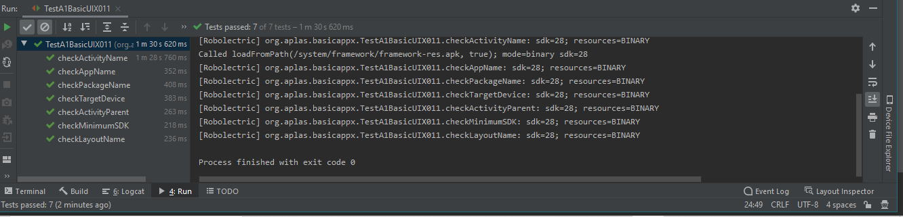

Hasil tes guide 2 :
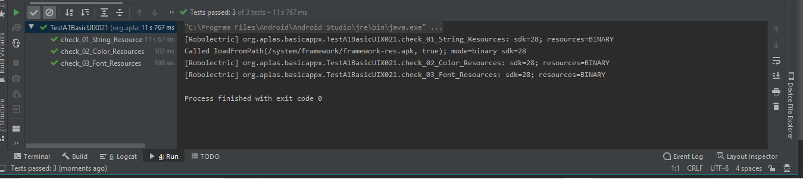

Hasil tes guide 3 :
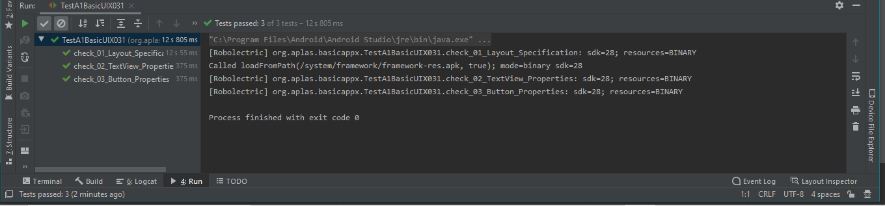

Hasil tes guide 4 :
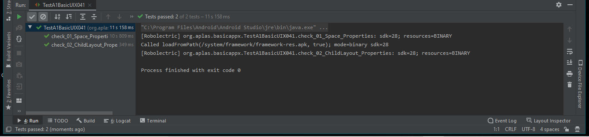

Hasil tes guide 5 :
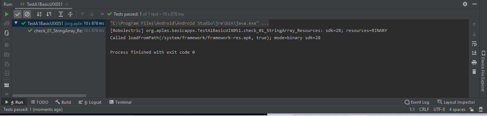
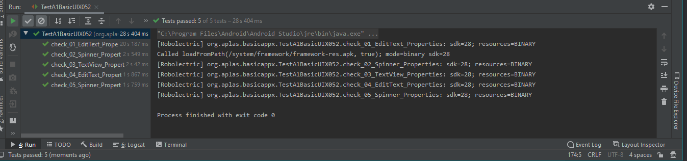

Hasil tes guide 6 :
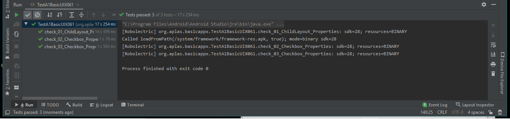

Hasil tes guide 7 :
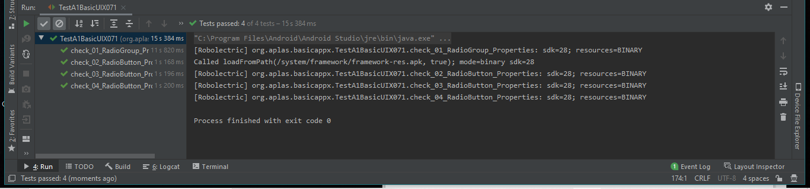

Hasil tes guide 8 :
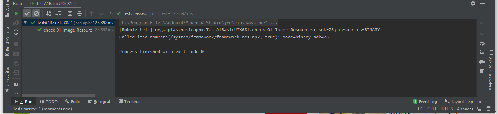
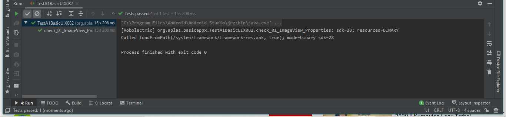

Hasil tes guide 9 :

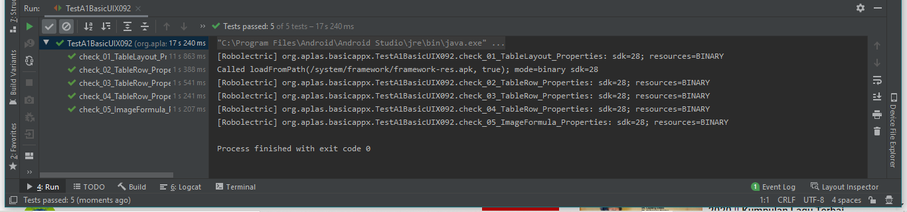

## Tampilan Layout
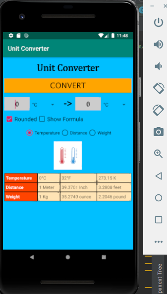
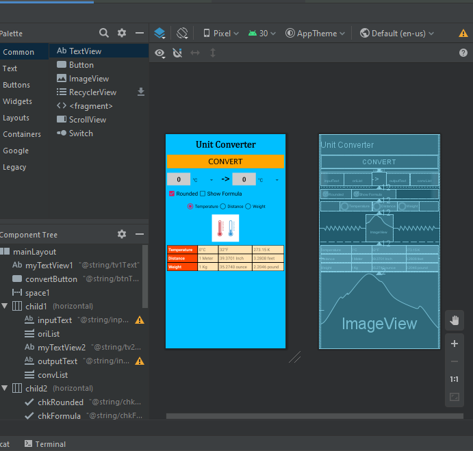

## Kesimpulan
Kita bisa memperluas ilmu tentang pemograman mobile dan
Siswa tahu cara memulai Proyek Android Studio dengan tata letak kosong.

## Pernyataan Diri

Saya menyatakan isi tugas, kode program, dan laporan praktikum ini dibuat oleh saya sendiri. Saya tidak melakukan plagiasi, kecurangan, menyalin/menggandakan milik orang lain.

Jika saya melakukan plagiasi, kecurangan, atau melanggar hak kekayaan intelektual, saya siap untuk mendapat sanksi atau hukuman sesuai peraturan perundang-undangan yang berlaku.

Ttd,

***(MUHAMMAD NUR FAIZIN)***
